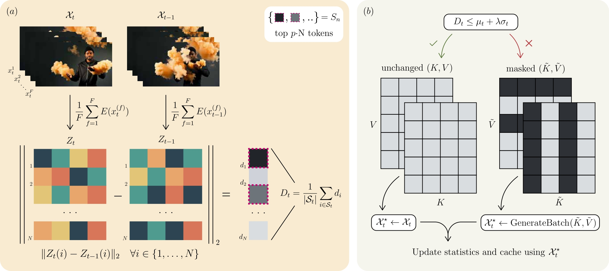

# TokenTrim: Inference-Time Token Pruning for Autoregressive Long Video Generation

**TokenTrim** is an inference-time method for stabilizing long-horizon autoregressive text-to-video generation.  
It mitigates temporal drift by identifying unstable latent tokens and **hard-pruning** them from the temporal KV cache before reuse, preventing error propagation across rollout steps.

Project page (code, examples, videos): https://amitedenzon.github.io/

---

<h2>Qualitative Results</h2>

<b>Prompt:</b> A humanoid appears out of smoke, then disperses and reforms.

  

    
<b>Rolling Forcing</b>

    <video width="320" controls>
      <source src="assets/videos/smoke_rolling.mp4" type="video/mp4">
    </video>
  

  

    
<b>+ TokenTrim</b>

    <video width="320" controls>
      <source src="assets/videos/smoke_ours.mp4" type="video/mp4">
    </video>
  

---

## 🔥 Highlights

- **Inference-time only**: no retraining, no fine-tuning, no model edits.
- **Latent-space token stability**: detects drift via latent summaries and prunes the most unstable tokens.
- **Works with autoregressive long-video inference**:
  - Rolling Forcing
  - Self Forcing
- **Minimal overhead**: pruning is lightweight and applied only when drift is detected.

---

## 🧠 Method Overview

TokenTrim identifies unstable latent tokens during autoregressive video generation and removes them from the temporal KV cache to prevent error propagation.

  

**Figure:** TokenTrim overview at autoregressive step *t*.  
(a) Latent summaries are computed for the previous batch and the candidate batch, and per-token drift is estimated by their difference. Tokens with the largest drift values form the unstable set.  
(b) If the drift severity exceeds an adaptive threshold, unstable tokens are masked in the temporal KV cache and the batch is regenerated using the pruned cache; otherwise, the batch is accepted and the cache is updated normally.

---

## 🧩 Supported Models / Pipelines

This repository provides code for TokenTrim integrated into:
- **Wan2.1-1.3B** text-to-video backbone
- Autoregressive long-video inference pipelines:
  - **Rolling Forcing** — official repo: https://github.com/TencentARC/RollingForcing
  - **Self Forcing** — official repo: https://github.com/guandeh17/Self-Forcing

> Note: exact configs, prompts, and qualitative results are curated on the project page:  
> https://amitedenzon.github.io/
---

## 🙏 Acknowledgments

TokenTrim builds on autoregressive long-video generation frameworks, including:
- Rolling Forcing: https://github.com/TencentARC/RollingForcing  
- Self Forcing: https://github.com/guandeh17/Self-Forcing  

More details and examples: https://amitedenzon.github.io/